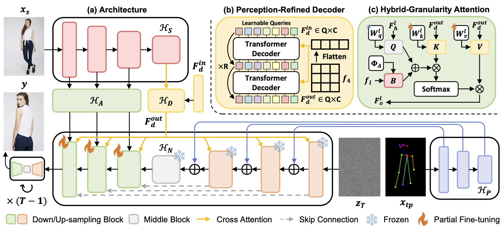

# CFLD [](https://arxiv.org/abs/2402.18078)

[CVPR 2024] Coarse-to-Fine Latent Diffusion for Pose-Guided Person Image Synthesis


## TL;DR
If you want to cite and compare with out method, please download the generated images from [Google Drive](https://drive.google.com/drive/folders/1wNXt23C18G5eae8nl11jcdkZ1HqLlMHp?usp=sharing) here.
(Including 256x176, 512x372 on DeepFashion, and 128x64 on Market-1501)



## Preparation

### Install Environment
```
conda env create -f environment.yaml
```

### Download DeepFashion Dataset
* Download [Img/img_highres.zip](https://drive.google.com/drive/folders/0B7EVK8r0v71pYkd5TzBiclMzR00?resourcekey=0-fsjVShvqXP2517KnwaZ0zw) from the **In-shop Clothes Retrieval Benchmark** of [DeepFashion](http://mmlab.ie.cuhk.edu.hk/projects/DeepFashion/InShopRetrieval.html), unzip it under `./fashion` directory. (Password would be required, please contact the authors for permission.)
* Download [train/test pairs and keypoints](https://drive.google.com/drive/folders/1qZDod3QDD7PaBxnNyHCuLBR7ftTSkSE1?usp=sharing) from [DPTN](https://github.com/PangzeCheung/Dual-task-Pose-Transformer-Network), put them under `./fashion` directory.
* Make sure the tree of `./fashion` directory is as follows.
    ```
    fashion
    ├── fashion-resize-annotation-test.csv
    ├── fashion-resize-annotation-train.csv
    ├── fashion-resize-pairs-test.csv
    ├── fashion-resize-pairs-train.csv
    ├── MEN
    ├── test.lst
    ├── train.lst
    └── WOMEN
    ```
* Run `generate_fashion_datasets.py` with python.

### Download Pre-trained Models
* Download the following pre-trained models on demand, put them under `./pretrained_models` directory.
    | Model | Official Repository | Publicly Available |
    | ----- | ------------------- | ------------------ |
    | U-Net | [runwayml/stable-diffusion-v1-5](https://huggingface.co/runwayml/stable-diffusion-v1-5) | [diffusion_pytorch_model.safetensors](https://huggingface.co/runwayml/stable-diffusion-v1-5/blob/main/unet/diffusion_pytorch_model.safetensors)
    | VAE | [runwayml/stable-diffusion-v1-5](https://huggingface.co/runwayml/stable-diffusion-v1-5) | [diffusion_pytorch_model.safetensors](https://huggingface.co/runwayml/stable-diffusion-v1-5/blob/main/vae/diffusion_pytorch_model.safetensors) |
    | Swin-B | [microsoft/Swin-Transformer](https://github.com/microsoft/Swin-Transformer) | [swin_base_patch4_window12_384_22kto1k.pth](https://github.com/SwinTransformer/storage/releases/download/v1.0.0/swin_base_patch4_window12_384_22kto1k.pth)
    | CLIP (ablation only) | [openai/clip-vit-large-patch14](https://huggingface.co/openai/clip-vit-large-patch14) | [model.satetensors](https://huggingface.co/openai/clip-vit-large-patch14/blob/main/model.safetensors) |
* Make sure the tree of `./pretrained_models` directory is as follows.
    ```
    pretrained_models
    ├── clip
    │   ├── config.json
    │   └── model.safetensors
    ├── scheduler
    │   └── scheduler_config.json
    ├── swin
    │   └── swin_base_patch4_window12_384_22kto1k.pth
    ├── unet
    │   ├── config.json
    │   └── diffusion_pytorch_model.safetensors
    └── vae
        ├── config.json
        └── diffusion_pytorch_model.safetensors
    ```

## Training
For multi-gpu, run the following command by default.
```
bash scripts/multi_gpu/pose_transfer_train.sh 0,1,2,3,4,5,6,7
```
For single-gpu, run the following command by default.
```
bash scripts/single_gpu/pose_transfer_train.sh 0
```
For ablation studies, run the following command by example to specify configs.
```
bash scripts/multi_gpu/pose_transfer_train.sh 0,1,2,3,4,5,6,7 --config_file configs/ablation_study/no_app.yaml
```

## Inference
For multi-gpu, run the following command by example to specify checkpoints.
```
bash scripts/multi_gpu/pose_transfer_test.sh 0,1,2,3,4,5,6,7 MODEL.PRETRAINED_PATH outputs/CFLD/no_app/epochs_100/checkpoints
```
For single-gpu, run the following command by example to specify checkpoints.
```
bash scripts/single_gpu/pose_transfer_test.sh 0 MODEL.PRETRAINED_PATH outputs/CFLD/no_app/epochs_100/checkpoints
```

## Citation
```bibtex
@inproceedings{lu2024coarse,
  title={Coarse-to-Fine Latent Diffusion for Pose-Guided Person Image Synthesis},
  author={Lu, Yanzuo and Zhang, Manlin and Ma, Andy J and Xie, Xiaohua and Lai, Jian-Huang},
  booktitle={CVPR},
  year={2024}
}
```

## Star History

[](https://star-history.com/#YanzuoLu/CFLD&Date)
